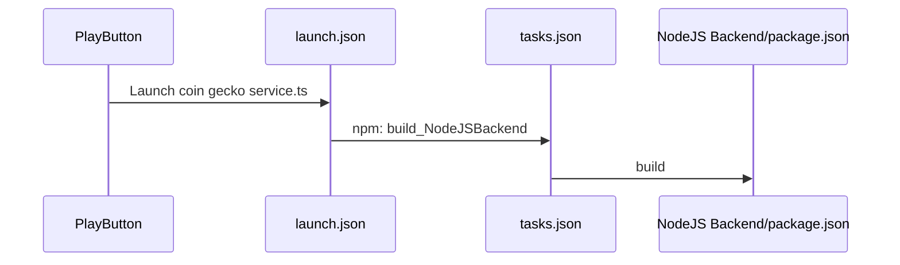

# Setting Up Typscript
##### /Users/daylannance/Documents/DEV/DDF/.vscode/tasks.json
##### /Users/daylannance/Documents/DEV/DDF/.vscode/launch.json
##### /Users/daylannance/Documents/DEV/DDF/NodeJS Backend/ package.json
###### /Users/daylannance/Documents/DEV/DDF/NodeJSBackend/tsconfig.json
###### /Users/daylannance/Documents/DEV/DDF/SERVER/.vscode/launch.json

